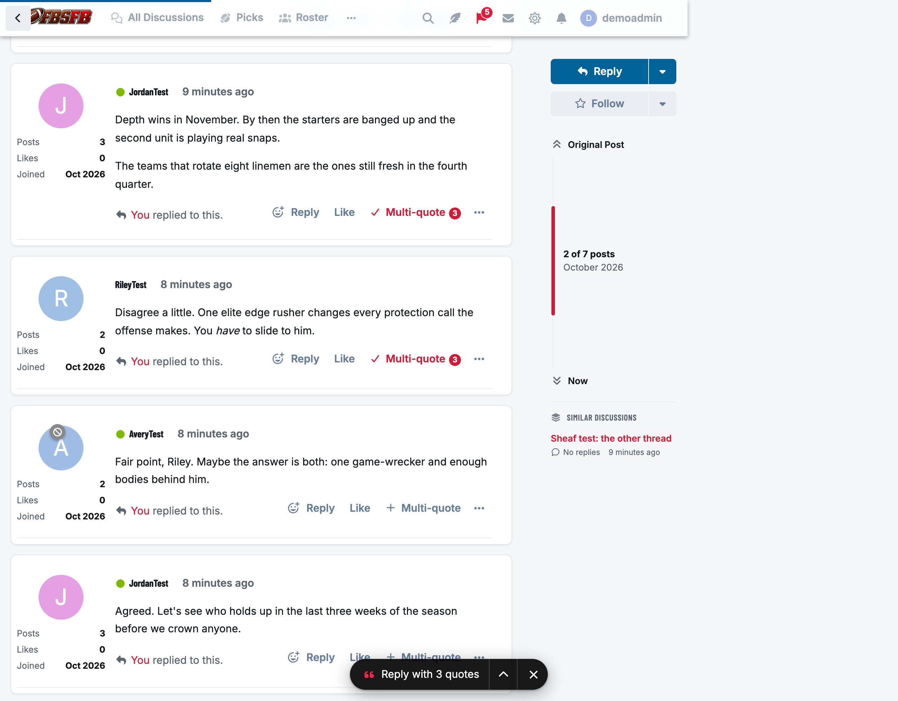
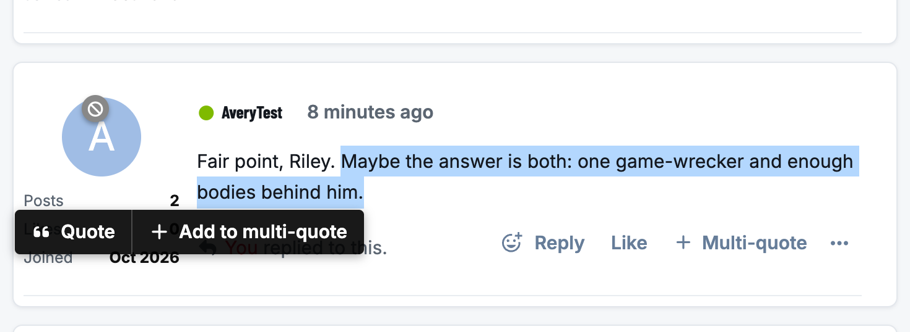
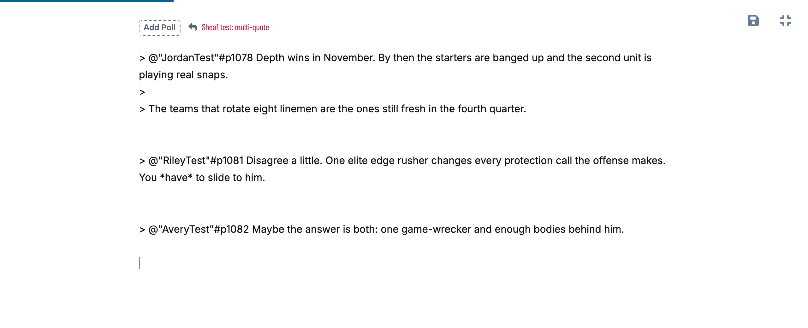
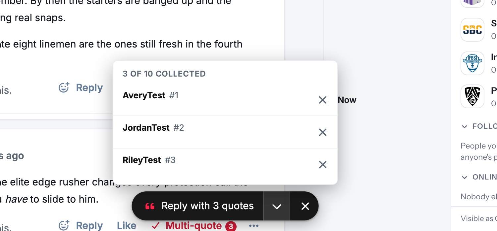
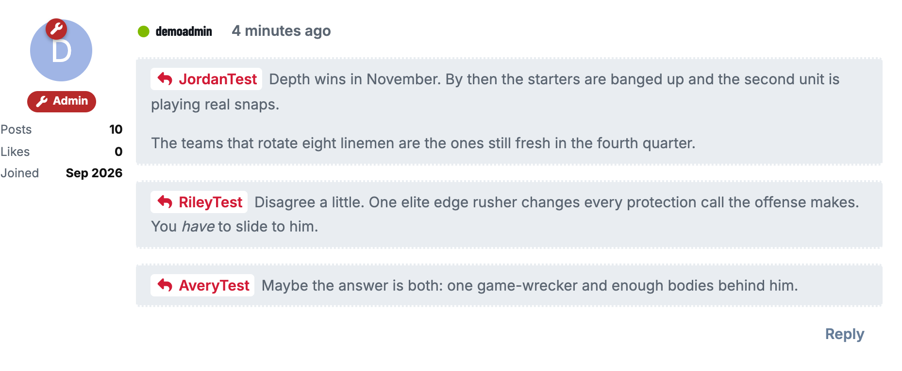
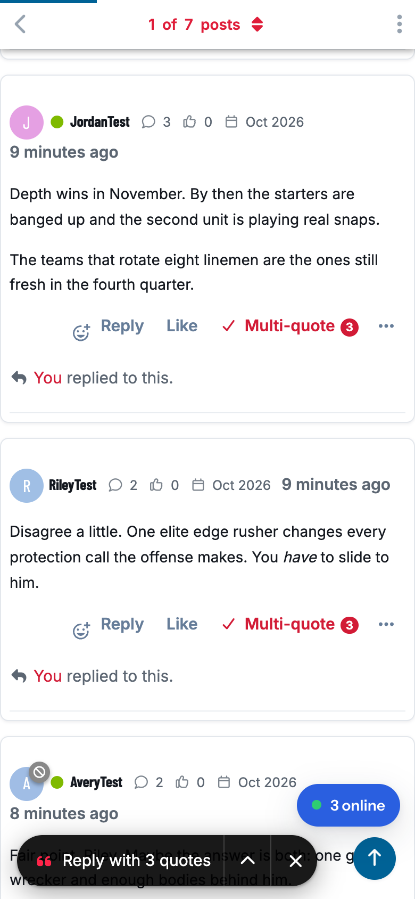

# Sheaf

Multi-quote for Flarum. Collect quotes from several posts, even in different discussions, then reply once with all of them. Traditional forums have always had this.



## How it works

- **Multi-quote** sits next to Reply on every post. Press it to collect the post, and press it again to let it go. A collected post's button is highlighted and shows how many quotes you have.
- **Part of a post.** Select some text and Flarum's quote popup gets an **Add to multi-quote** button beside Quote, so you can collect just the sentence you want to answer.

  

- **Reply with 3 quotes.** A pill at the bottom of the discussion page shows what you've collected. Press it and the reply composer opens with every quote inserted in thread order. If a composer is already open, the quotes go into that one.

  

- **See what you've collected.** The arrow on the pill lists each quote: whose it is, which post, and the selected text if you collected only part of one. Remove any of them there, or clear the lot with ×. Clearing shows an Undo.

  

- **Across discussions.** Your collection follows you around the forum. Quotes from another discussion go into your reply with a link back to where they came from.

The quotes use the same format as Flarum's own Quote button, so every quote links to the post it came from and the quoted member gets a notification, as usual:



Your collection is kept in the browser until the reply is **posted**. If you close the composer without posting, your quotes are still there.

## On phones

The pill sits above the composer, any bar fixed to the bottom of the screen, and the home indicator. It keeps clear of the round buttons that themes put in the bottom-right corner.



## Settings

Admin → Sheaf:


- **Most quotes a member can collect:** 10 by default.

Sheaf only shows its buttons to members who can reply to the discussion. It uses your theme's own colours, so it fits the default theme, Bespoke and dark mode without any styling.

## Good to know

- **Flarum Mentions is recommended.** With it, each quote is a post mention (`> @"Name"#p123 …`). That's where the link to the quoted post and the notification come from, and it's also what adds the selected-text popup. Without Mentions, quotes are inserted as plain quotes headed "Name wrote:".
- **Works with editors that convert Markdown.** Quotes go into the composer through the editor's normal insert method, the same one Mentions' Quote button uses, so a rich-text editor such as [Scribe](https://github.com/ernestdefoe/scribe) gets them in a form it already understands.
- **One request, not one per quote.** Posts already on the page are quoted straight away. Any others are fetched in a single request when you reply.
- **Separate quotes stay separate.** Flarum's Markdown merges quotes that have only one blank line between them, so Sheaf leaves two blank lines between its quotes.

## Installation

```bash
composer require ernestdefoe/sheaf
php flarum cache:clear
```

Then enable **Sheaf** in the admin panel.

## Updating

```bash
composer update ernestdefoe/sheaf
php flarum cache:clear
```

## Licence

MIT.
